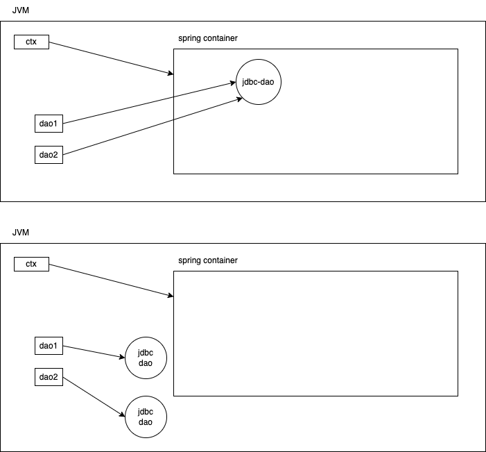

# Spring concepts

# Bean scopes

- `singleton` - default
  - a bean created and stored in the container, when the container is created/refreshed
    - `new ClassPathXmlApplicationContext("context1.xml")`
  - only one instance of the bean is maintained by the spring container
  - spring keeps a referent to this bean until the spring container lives in the JVM
  - by default, the singleton beans are created `eagerly`
    - by using the `lazy-init="true"` for bean definition, the bean can be created lazily
      - when the `ctx.getBean(..)` is called for the first time, only then the bean is constructed
      - subsequent calls to `ctx.getBean(..)` will only return the previously created bean reference
- `prototype`
  - bean objects of this scope are created only when requested (ctx.getBean(..))
  - every time you are asking for a bean, new bean is constructed and given to you
  - spring does not keep track of these beans
  - prototype beans are always `lazy`ly created
