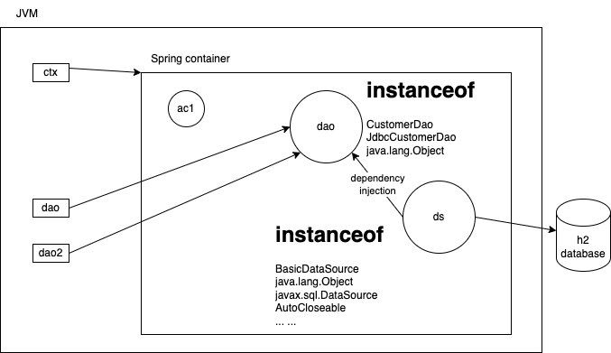

# Scope in pom.xml dependency

Allows you to control the visibility and availability of the dependency (classes and interfaces coming from the jar file) during different phases of the maven build lifecycle.

- **compile**
  - this is the default scope
  - the dependencies are required for compiling and running the main source code
  - also part of the runtime
- **provided**
  - it is available during compilation, but during the runtime, the running platform should provide the dependency
- **runtime**
  - available at the runtime, but not during compile time
- **test**
  - available only to the test source code in your project
  - and during runtime

