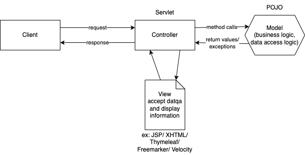
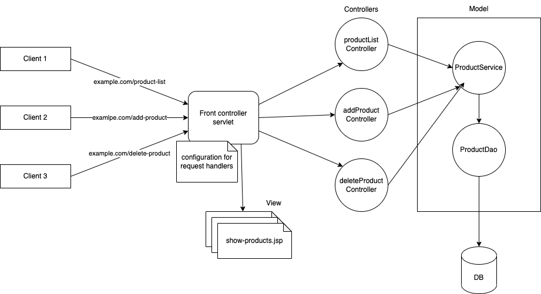
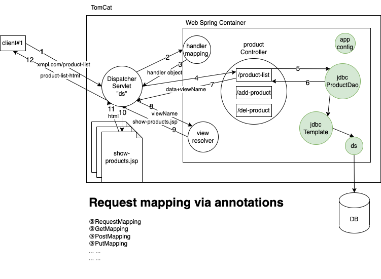

# MVC and Spring MVC

- MVC - Model, View and Controller
- an architectural design pattern
- focus on separation of concerns
- Model -> takes care of business logic and data access logic
- View -> takes care of presentation logic
- Controller -> coordinates between the client, model and the view

Front controller design pattern

- One main controller interacts with the client
- based on the client requests, delegates the requests to the sub controllers
- MVC frameworks like Apache Struts, JavaServer faces, or Spring MVC all of them apply this pattern
  - Struts --> ActionServlet
  - JSF --> FacesServlet
  - Spring MVC --> DispatcherServlet

Spring MVC

- provides a front controller called `DispatcherServlet` (which is a regular java servlet)
  - we need to create an object of this servlet (dispatcherServlet)
  - load this on tomcat's startup
  - map this servlet to handle all incoming requests (for example, '/' or '/\*')
- we have to create a spring container (`AnnotationConfigWebApplicationContext`) and register the same with the dispatcherServlet
  - the spring container would load all beans from the corresponding annotation based configuration class (for example, `AppConfig`)
    - The `AppConfig` would define the beans required or configured with `@ComponentScan`
      - Component scan --> controllers, service and dao beans
      - @Bean --> transaction-manager, entity-manager-factory, data-source

