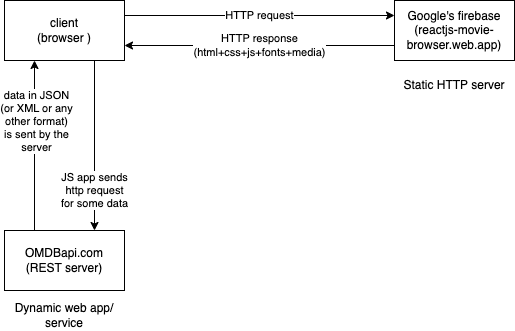

# REST

- REpresentational State Transfer
- Transfer (exchange between client/server) of state (information/data) in different representations (formats such as XML or JSON etc.)



- originally the concept was part of a doctoral thesis by Roy Fielding, who is the co creator of HTTP protocol
- based on 6 constraints laid out by Roy
  1. Client/server
  1. Stateless
  1. Uniform interface
     - we consider the server to provide access to a `resource`, using a uniform interface
     - `URL` or `URI` can be used to represent a resource
       - a `resource` is a collection of `state`
       - `products` is a **resource**, while a the data represented by a `single product` is a **state**
       - the general practice is to expose a resource using `/api/*` URL
         - for example, `http://localhost:8080/api/products`
     - we can perform the following operations on the state of a resource
       - create a new state (HTTP POST method can be used to add a new entry in the products resource)
       - get the state from a resource using the id (HTTP GET method can be used to get the details of a product)
       - modify the state (HTTP PUT or PATCH methods can be used)
       - delete the state (HTTP DELETE method)
     - client can negotiate with the server for different formats of the state
       - HTTP request header `Accept` and `Content-Type` for this
  1. Layered
  1. Cacheable
  1. Code on demand (optional)

## HTTP as the protocol for everything

- clients use HTTP'S RFC2616 format to send the request and the server responds to the client in the same format

- the request has 3+ parts

1. request line consisting of
   1. http method (get/post/put/delete/...)
   1. path to the resource (consists of segments, eg., /api/products/34)
   1. optional http version
1. one or more lines representing request headers. A header is a key/value pair delimited using colon (:)
1. request body or payload (only for post/put/patch requests)

Note: there must be a mandatory blank line between the headers and the payload

Example:

```http
GET /?apikey=aa9e49f&i=tt0325980
Host: www.omdbapi.com
Accept: application/json
```

The response has 3 parts as well

1. status line
   1. http version
   1. status code
   1. (optional) status text
1. response headers
1. after a line gap, the response body

```http
HTTP/1.1 200 OK
Date: Mon, 03 Jul 2023 09:39:46 GMT
Content-Type: application/json; charset=utf-8
Transfer-Encoding: chunked
Connection: close
Cache-Control: public, max-age=86400
Expires: Mon, 03 Jul 2023 10:39:46 GMT
Last-Modified: Mon, 03 Jul 2023 09:39:46 GMT
Vary: *, Accept-Encoding
X-AspNet-Version: 4.0.30319
X-Powered-By: ASP.NET
Access-Control-Allow-Origin: *
CF-Cache-Status: MISS
Server: cloudflare
CF-RAY: 7e0e29c8c9036ef5-BOM
Content-Encoding: gzip

{
  "Title": "Pirates of the Caribbean: The Curse of the Black Pearl",
  "Year": "2003",
  "Rated": "PG-13",
  "Released": "09 Jul 2003",
  "Runtime": "143 min",
  "Genre": "Action, Adventure, Fantasy",
  "Director": "Gore Verbinski",
  "Writer": "Ted Elliott, Terry Rossio, Stuart Beattie",
  "Actors": "Johnny Depp, Geoffrey Rush, Orlando Bloom",
  "Plot": "Blacksmith Will Turner teams up with eccentric pirate \"Captain\" Jack Sparrow to save his love, the governor's daughter, from Jack's former pirate allies, who are now undead.",
  "Language": "English",
  "Country": "United States",
  "Awards": "Nominated for 5 Oscars. 38 wins & 104 nominations total",
  "Poster": "https://m.media-amazon.com/images/M/MV5BNGYyZGM5MGMtYTY2Ni00M2Y1LWIzNjQtYWUzM2VlNGVhMDNhXkEyXkFqcGdeQXVyMTMxODk2OTU@._V1_SX300.jpg",
  "Ratings": [
    {
      "Source": "Internet Movie Database",
      "Value": "8.1/10"
    },
    {
      "Source": "Rotten Tomatoes",
      "Value": "80%"
    },
    {
      "Source": "Metacritic",
      "Value": "63/100"
    }
  ],
  "Metascore": "63",
  "imdbRating": "8.1",
  "imdbVotes": "1,155,040",
  "imdbID": "tt0325980",
  "Type": "movie",
  "DVD": "25 Jan 2005",
  "BoxOffice": "$305,413,918",
  "Production": "N/A",
  "Website": "N/A",
  "Response": "True"
}
```

## HTTP response status codes

- 200 - Okay
- 201 - Created (used for POST, where a new state is added to the resource)
- 204 - no content from the server
- 400 - bad request (usually invalid input sent by the client)
- 401 - Unauthorized
- 403 - Forbidden
- 404 - Not found
- 405 - HTTP method not implemented
- 406 - Not acceptable (format of data wanted by the client is not available)
- 500 - internal server error (an exception was thrown but not handled)

For the complete list of codes:
https://developer.mozilla.org/en-US/docs/Web/HTTP/Status

# Steps to create a new Maven WAR project for REST application

1. create a maven simple project with `war` as the project type
1. add the required dependencies
1. Create a class `com.infosys.config.AppConfig` as shown below:

```java
@Slf4j
@Configuration
@EnableWebMvc
@ComponentScan({"com.infosys.dao", "com.infosys.controllers"})
@PropertySource({"classpath:jdbc-info.properties"})
public class AppConfig implements WebApplicationInitializer{

	@Override
	public void onStartup(ServletContext servletContext) throws ServletException {
		log.trace("AppConfig.onStartup() called");
	}

}
```

1. make sure that you have the following files in the `src/main/resources` folder
   - log4j.properties
   - jdbc-info.properties
