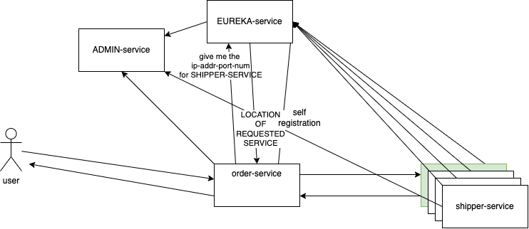

# Register a service with admin-service

1. Update the `pom.xml` with the following changes:

- add the following property in the `<properties>` section

```xml
<spring-boot-admin.version>3.1.1</spring-boot-admin.version>
```

- add the following section called `dependencyManagement`
  - if it is already there, then add the corresponding dependency only

```xml
<dependencyManagement>
    <dependencies>
        <dependency>
            <groupId>de.codecentric</groupId>
            <artifactId>spring-boot-admin-dependencies</artifactId>
            <version>${spring-boot-admin.version}</version>
            <type>pom</type>
            <scope>import</scope>
        </dependency>
    </dependencies>
</dependencyManagement>
```

- add the following dependency in the dependency list

```xml
<dependency>
    <groupId>de.codecentric</groupId>
    <artifactId>spring-boot-admin-starter-client</artifactId>
</dependency>
```



