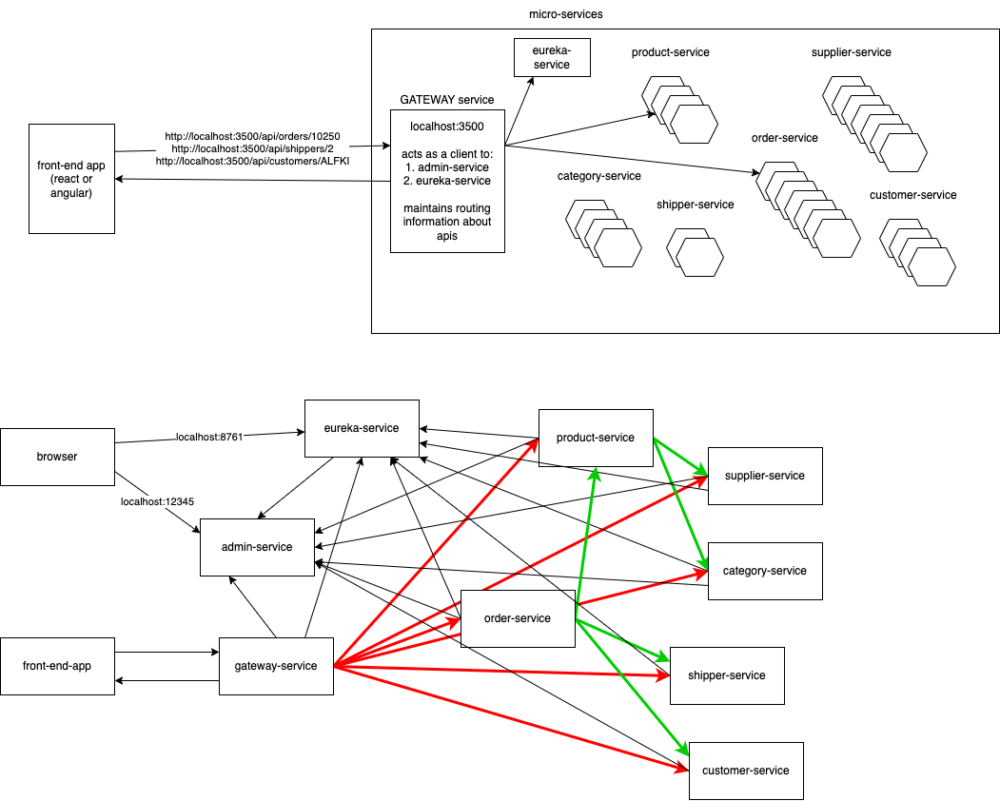

output from the order-service for a given id should be:

```json
{
    "orderId": 10300,
    "orderDate": "1996-09-08T18:30:00.000+00:00",
    "requiredDate": "1996-10-06T18:30:00.000+00:00",
    "shippedDate": "1996-09-17T18:30:00.000+00:00",
    "customer": {
        "customerId": "MAGAA",
        "companyName": "Magazzini Alimentari Riuniti",
        "contactName": "Giovanni Rovelli",
        "contactTitle": "Marketing Manager",
        "city": "Bergamo"
    },
    "shipper": {
        "shipperId": 2,
        "companyName": "United Package",
        "phone": "(503) 555-3199"
    },
    "freight": 17.68,
    "employee": {
        .....
        ....
    },
    "lineItems": [
        {
            "product": {
                "productId": 2,
                "productName": "...",
                ..
                ..
                ..
            },
            "quantity": 3,
            "unitPrice": 12.45,
            "discount": 0.15
        },
        {...},
        {...}
    ]
}

```
