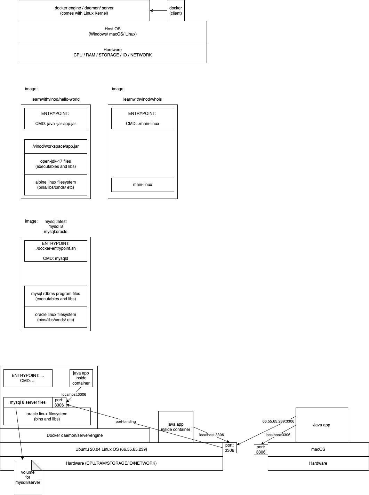

Some docker commands:

- `docker image ls`
  - same as `docker images`
  - displays the list of all images in your host os
- `docker ps`
  - displays the list of all running container
  - `docker ps --all` or `docker ps -a` displays the list of all running and stopped containers
- `docker rmi <image-name-or-id>`
  - deletes the specified image
- `docker container prune`
  - deletes all the stopped containers
- `docker exec -it <container-id-or-name> <command-to-execute>`
  - executes the specified command on a running container with the given id or name
- `docker stop <container-id-or-name>`
  - stops the running container gracefully
- `docker kill <container-id-or-name>`
  - terminates the running container ASAP
- `docker logs <container-id-or-name>`
  - displays the logs of the running container with the given id

Following command creates a container named `mysql8server`, exposing the container port 3306 on the host os port 3306

```
docker run -d \
    --name mysql8server \
    -p 3306:3306 \
    -e MYSQL_ROOT_PASSWORD=Welcome#123 \
    -v mysql8volume:/var/lib/mysql \
    mysql:latest

```

Some mysql commands:

```sql
create database infydb;
use infydb;
select database();
show tables;
create table persons (id int primary key auto_increment, name varchar(50));
insert into persons (name) values ('Vinod'), ('Shyam'), ('Ramesh'), ('Rakesh');
show tables;
select * from persons;
desc persons;
```
