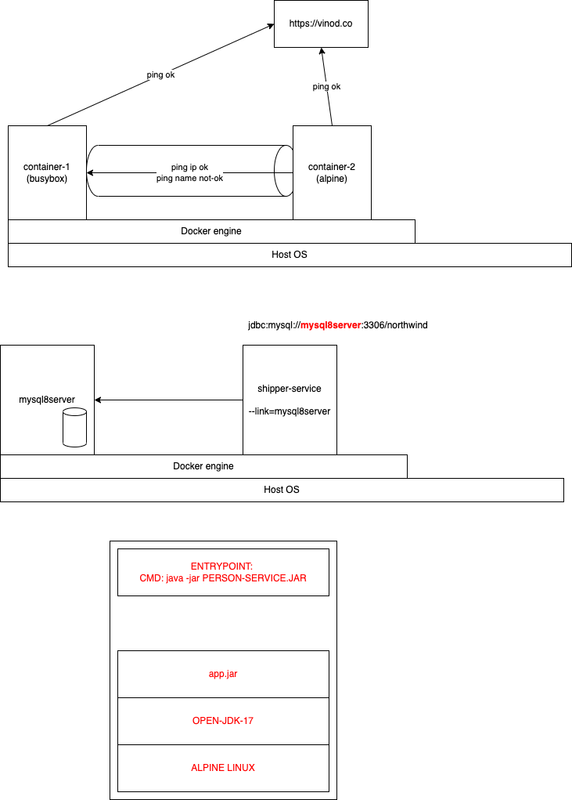

Try these:

`docker run -d --rm --name=cntr1 busybox:latest ping vinod.co`

`docker run --rm --name=cntr2 -it alpine:latest`

The second command creates a new container, and will take you inside the same. When you try pinging the `cntr1`, you will get an error:

```
ping cntr1
```

exit the cntr2 and recreate with the following command:

```
docker run --rm --name=cntr2 -it --link cntr1 alpine:latest
```

Now, if you try pinging the cntr1, it will work


# Create a network

```
docker network ls

docker network create mynetwork

docker inspect mynetwork

docker network connect mynetwork cntr1

docker inspect mynetwork

docker inspect cntr1

docker run -dit --name=cntr2 --network=mynetwork --rm alpine:latest
```