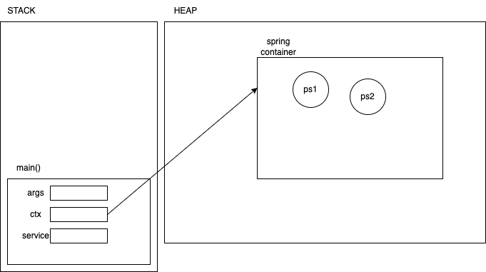

# Maven build lifecycle phases

- validate
- initialize
- generate-sources
  - generates any source code required by tools like lombok
- process-sources
- generate-resources
- process-resources
- compile
  - maven compiles all the generated sources and dumps the output to the ./target/classes folder
  - the test files are not compiled here
- generate-test-sources
- process-test-sources
- generate-test-resources
- process-test-resources
- test-compiles
  - compiles the java source files from src/test/java
- test
  - runs the unit tests
  - uses the surefire plugin
- package
  - creates a jar from the generated class files
  - the jar has the name pattern: {artifact-id}-{version}.jar
  - can be changed by adding final-name xml element under build
- install
  - installs the generated jar file into the local repository
- deploy
  - deploys the generated package (jar file) into a remote repository, making it available to other developers across the globe

# Spring

```java

public interface ProductDao {
    public void addNewProduct(Product p);
    ///...
}

public class ProductService {

    @Autowired
    private ProductDao dao;

    // public ProductService(){
    //     this is a dependency look up (which was what EJB used to)
    //     dao = DaoFactory.getProductDao();
    // }

    public void addNewProduct(Product p) {
        dao.save(p);
    }

}

```

- Spring is a factory for manufacturing `beans`, which are nothing but objects classes
- Spring manages the dependencies of beans in the container


