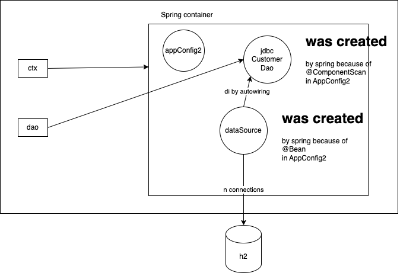

# Components and Component Scan

## Component ?

- a class decorated with one of these annotations:
  - @Service
    - Any class of your project that has business logic
      - In a banking application, a class that provides `transferFund(..)` method
      - In an e-commerce app, `initiateOrderRefund(..)` is part of a service class
  - @Repository
    - Any class involved in persistence mechanism
    - DAO classes, provide `CRUD` operations and `Query` functions
  - @Controller, @RestController
    - Part of web tier
    - Generally handle client inputs and convert them into domain specific objects, and then coordinates with model (the service layer objects) and invokes business functions, collects the data from the service layer, and pass them to the `view`
  - @Configuration
  - @Component: a generic annotation that can be applied on any class

