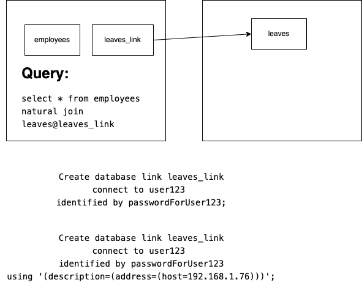
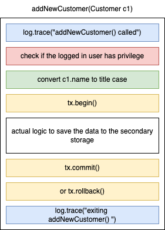
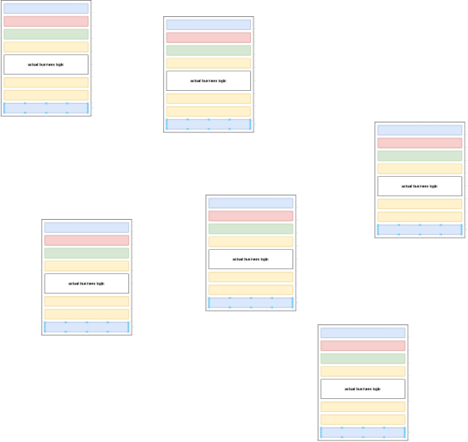
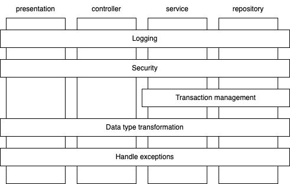
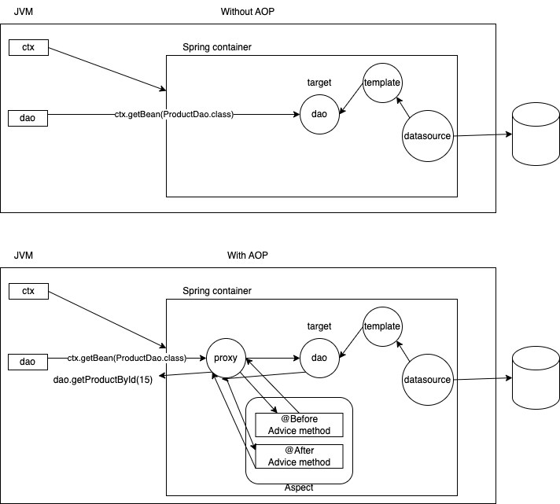

# AOP

- Aspect Oriented Programming
- Address cross cutting concerns
  - Logging, Transaction management, Security, Data transformation
- There are multiple layers in an application, and in each layer, there will be multiple classes
  - For example:
    - DAL (Data Access Layer or Repository layer)
      - ProductDao
      - CustomerDao
      - EmployeeDao
      - etc
  - In each of these classes, if we have to generate logs about entry and exit
    - Code gets scattered
    - Same logging code `log.trace("....")` is scattered across thousands of functions in hundreds of classes
  - In each of these classes, apart from the actual logic of the function, we may also have to do the following:
    - Check for security (whether the user has appropriate privileges to call such a function)
    - Begin transaction (`tx.begin()`, for some functions when entered)
    - End the transaction (`tx.commit()` for some functions when exiting)
    - End the transaction (`tx.rollback(), for some functions, if there are exceptions thrown)
    - Parameters may have to be modified
    - All of these makes the code tangling (spaghetti code)







- AOP enables separation of cross-cutting-concerns

### Terminologies

- Aspect:
  - The cross cutting concern
  - In Spring AOP it is a class that is annotated with @Aspect
  - In this class, we define the solution to the cross cutting concern, using functions
- Advice:
  - a function that provides a solution to the concern (for example, logging or converting an exception into a custom exception, or beginning a transaction etc.)
  - 5 types of advices:
    - Before advice (@Before)
    - After returning advice (@AfterReturning)
    - After throwing advice (@AfterThrowing)
    - After advice (@After)
    - Around (i.e, before and after) (@Around)
      - is the most powerful of all advices, since this can modify the flow or method parameters
- JoinPoint

  - Where an advice can be applied in your application
  - In spring AOP, **execution of a function** is the join point.

- Pointcut

  - a subset of Join points, where the actual advice is applied
  - we us AspectJ predicate language expression for determining where the advice should be applied

- Proxy

  - a spring created object, that has all the methods of the bean, but simply delegates your calls to the actual target object

- Target
  - the actual bean that we want to intercept and perform cross cutting concerns

```java
list = dao.getProductsInPriceRange(50, 500);
list = dao.getProductsInPriceRange(500, 50);
dao.updateCustomerName(1002, "VINOD KUMAR"); // Vinod Kumar
```



### AspectJ Pointcut Expression Language

```
execution(modifier-pattern? return-type-pattern declaring-type-pattern?.method-pattern(argument-pattern) throws-pattern?)
```
