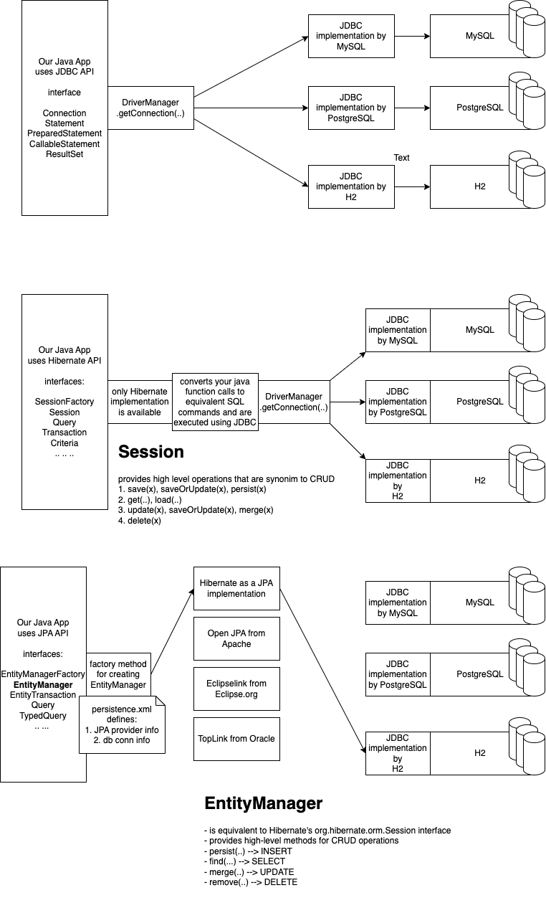

# ORM, Hibernate and JPA

## Difficulties of using JDBC

- Low level API
- requires writing of explicit SQL commands
- code becomes redundant as the codebase grows
- Object-relational impedance mismatch
- limited support for complex queries
- boilerplate code
- lack of flexibility

## ORM - Object Relation Mapper

- Object - an instance of a Java class
- Relation - table in an RDBMS DB
- Maps a table to a class and the columns of a table to the properties of the class (object)
- provides association between objects that resembles the relationship between two tables in an RDBMS
  - one-to-many
  - many-to-one
  - one-to-one
  - many-to-may
- The first prominent ORM was provided by EJB specification
  - EntityBeans
  - Container managed persistence
  - Bean managed persistence
  - very complex architecture
  - ORM is limited to be used with in an application server
    - no standalone application can use ORM

### Hibernate ORM

- a simple replacement of EJB's Entity beans
- back to POJO
  - the entity class has no obligations to implement any interface (like EJB's javax.ejb.EntityBean)
- a simple mapping of the class/properties to the table/columns using a XML document
  - Java 5 introduced annotations, and hibernate started replacing their XML mapping with annotation based mapping
    - @Entity, @Table, @Column, @Id etc

### JPA

- Java Persistence API
- an API for ORM
- Part of EJB 3.x specification, but can be used in a standalone mode
  - took lots of inspiration from Hibernate
- From the start, provided the class-to-table, fields-to-column and other mappings using annotations
- JPA is just a specification (no software)
  - a bunch of interfaces (like that of JDBC)
    - jakarta.persistence.EntityManagerFactory
    - jakarta.persistence.EntityManager
    - jakarta.persistence.Query
    - jakarta.persistence.TypedQuery
    - jakarta.persistence.EntityTransaction
  - implementations are available from different vendors
    - Hibernate
    - Eclipse eclipselink
    - Apache OpenJPA
    - Oracle toplink

